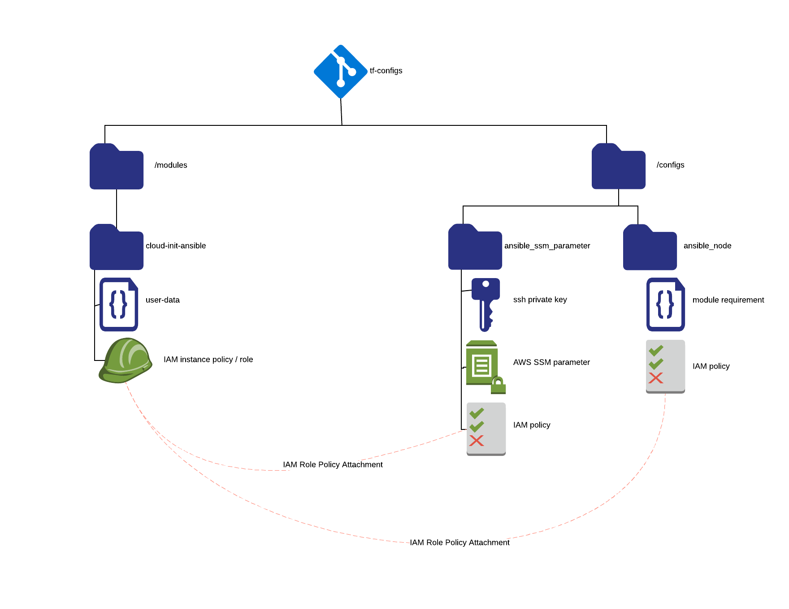

# cloud_init_ansible

This module creates user-data for Amazon EC2 instances to run `ansible-pull` through cloud-init.
Along with the user-data, it will store an SSH private key in AWS SSM Parameter Store and 
create an IAM profile allowing read access to the stored parameter.  The EC2 instance's IAM 
permissions can be extended by attaching additional policy documents to the linked IAM role.

The module injects four environment variables into the user-data:

* ENV is the environment that the EC2 instance resides in (e.g. development, production)
* ORG is the organization that the EC2 instance belongs to (e.g. your company name)
* HOSTGROUP places the EC2 instance into an Ansible host group (like a Chef role)
* REPO is the URL of your Ansible playbooks Git repository

All EC2 instances will end up in two host groups -- `$ENV` and `$HOSTGROUP` -- if you use the
hostgroup.py inventory script, from the examples folder, in your ansible repo's inventory scripts.

# Setup



By including the module and passing in some variables, you will end up with an IAM instance
profile that allows your EC2 instance to retrieve a private SSH key.  This key is for use
with ansible-pull (or git clone). 

## Including the module

Note that in this directory, there is a script called "create-skel.sh."  
The script will create a \_bootstrap.tf file in the root of your config:

```
variable "HOSTGROUP" { }
variable "REPO" { }

module "cloud_init_ansible" {
  source = "../../modules/cloud_init_ansible"
  ENV = "${var.ENV}"
  ORG = "${var.ORG}"
  HOSTGROUP = "${var.HOSTGROUP}"
  REPO = "${var.REPO}"

  CREATE_SSM_PARAMETERS = "false"
  CREATE_ANSIBLE_GIT_KEY = "false"
  ANSIBLE_GIT_KEY = "~/.ssh/ansible_rsa"
}
```

Optionally, you can edit the \_bootstrap.tf file and change some of the values:

| Variable               |                                                                         | Default     | 
|------------------------|-------------------------------------------------------------------------|-------------|
| CREATE_SSM_PARAMETERS  | Stores an SSH key used by git / ansible-pull in AWS SSM Parameter Store | false       |
| CREATE_ANSIBLE_GIT_KEY | Creates an SSH key for use with an Ansible git repository               | false       |
| ANSIBLE_GIT_KEY        | SSH key file name                                                       | ansible_rsa |

## Example: creating the SSM parameter

The \_bootstrap.tf and \_varaibles.tf files in the examples folder actually create a private SSH key and store them
in an AWS SSM parameter.

# Using Outputs

There are two user-data outputs, `debian` and `redhat`:

Just insert the results of the module in your user_data, when creating an instance or a launch config:

```
resource "aws_instance" "mine" {
  ami           = "${module.redhat_ami.id}"
  user_data     = "${module.cloud_init_ansible.redhat_user_data}"
  tags {
    Environment = "${terraform.workspace}"
  }
}
```

# Using / Extending IAM permissions

There are outputs for IAM instance profiles and roles: `iam_instance_profile_id` and `iam_role_name`.
For example, attach a profile to an EC2 instance:

```
resource "aws_instance" "mine" {
  ami                  = "${module.redhat_ami.id}"
  iam_instance_profile = "${module.cloud_init_ansible.iam_instance_profile_id}"
  ...
  tags {
    Environment        = "${terraform.workspace}"
  }
}
```

Or, extend an EC2 instance's permissions by creating a new policy and attaching it to the IAM role:

```
resource "aws_iam_policy" "read_ssm_parameters" {
  ...
}

resource "aws_iam_policy_attachment" "ssm_parameters_attach" {
  name       = "ssm_parameters_attachment"
  roles      = ["${module.cloud_init_ansible.iam_role_name}"]
  policy_arn = "${aws_iam_policy.read_ssm_parameters.arn}"
}
```
